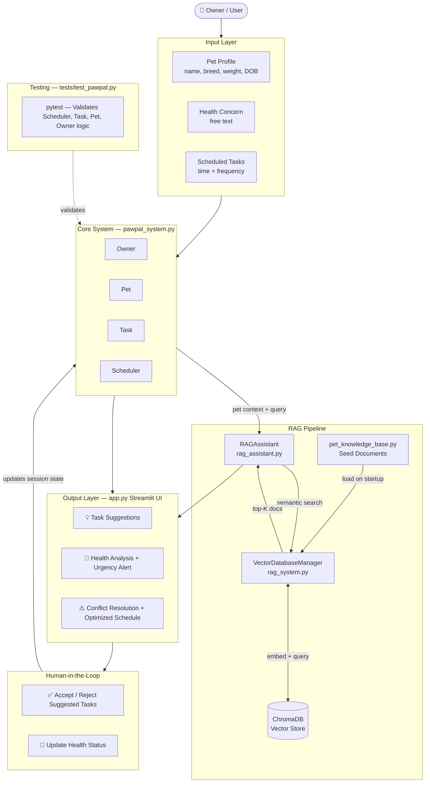

# PawPal+ — AI-Powered Pet Care Scheduler

## Original Project (Module 2)

**PawPal+** began as a structured pet care management system built in Python. The original system modeled four core domain objects — `Owner`, `Pet`, `Task`, and `Scheduler` — giving owners the ability to register multiple pets, assign recurring care tasks (daily, weekly, or one-time), sort and filter their schedule, detect time conflicts across pets, and automatically generate the next occurrence of a completed recurring task. A Streamlit web interface made all of this accessible through a browser without a command line.

---

## Title and Summary

**PawPal+ with RAG** extends the original scheduler with a Retrieval-Augmented Generation (RAG) layer that makes the app genuinely intelligent. Instead of only tracking tasks the owner manually creates, the system can now:

- **Suggest care tasks** based on a pet's species, breed, age, and weight by querying a curated knowledge base
- **Analyze health concerns** described in plain text and return urgency-rated guidance with recommended actions
- **Resolve scheduling conflicts** with context-aware suggestions pulled from pet care best practices

This matters because most pet care apps are passive — they store what you tell them. PawPal+ actively reasons about your pet's needs and surfaces information the owner might not know to ask for.

---

## Architecture Overview



**Component breakdown:**

| File | Role |
|---|---|
| `pawpal_system.py` | Core domain models: Owner, Pet, Task, Scheduler |
| `pet_knowledge_base.py` | Static pet care documents used to seed the vector database |
| `rag_system.py` | `VectorDatabaseManager` — wraps ChromaDB, handles embedding and semantic search |
| `rag_assistant.py` | `RAGAssistant` — three use-case methods that retrieve context and generate responses |
| `app.py` | Streamlit UI — wires all components together for the browser |
| `main.py` | CLI demo script for the original core scheduler logic |
| `tests/test_pawpal.py` | pytest suite validating all Scheduler and Task behavior |

**Data flow in one sentence:** the user's input hits the Streamlit UI → the RAGAssistant builds a query from the pet's profile → ChromaDB returns the most semantically relevant knowledge base documents → the assistant synthesizes a response → the UI displays it and waits for the human to accept or reject it.

---

## Setup Instructions

### Prerequisites

- Python 3.11 or 3.12 recommended (3.13 works with the steps below)
- pip

### 1. Clone the repository

```bash
git clone <your-repo-url>
cd ai110-module2show-pawpal-starter
```

### 2. Install dependencies

```bash
pip install "numpy>=2.1" --only-binary=:all:
pip install -r requirements.txt
```

> **Note:** The two-step install is required on Python 3.13. Older numpy versions have no pre-built wheel for 3.13 and will fail to compile from source. Installing numpy first with `--only-binary` forces pip to use a compatible pre-built wheel.

### 3. Verify the RAG system

```bash
python rag_system.py
```

Expected output:
```
✅ Loaded 7 documents into vector database

🔍 Search results:
📄 dog_exercise_001
   Content: Dogs need daily exercise. General guidelines...
📄 conflict_resolution_001
   Content: Optimal pet scheduling practices...
📄 dog_feeding_001
   Content: Dog feeding guidelines...
```

### 4. Run the app

```bash
streamlit run app.py
```

Opens at `http://localhost:8501`. Create your owner profile first — the rest of the app unlocks after that step.

### 5. Run the tests

```bash
pytest tests/test_pawpal.py -v
```

---

## Sample Interactions

### 1. AI Task Suggestions

**Input:** Owner adds a 4-year-old Golden Retriever named Max, 30 kg, healthy. Clicks "Generate Task Suggestions."

**Output:**
```
Found 3 suggested tasks!

📋 Dog feeding - twice daily
   Time: 18:00  |  Frequency: Daily  |  Category: Feeding
   Why: Adult dogs typically fed at consistent times

📋 Dog exercise - 30-45 minutes walk
   Time: 17:30  |  Frequency: Daily  |  Category: Exercise
   Why: Daily exercise prevents obesity and behavioral issues

📋 Golden Retriever grooming - brush coat
   Time: 10:00  |  Frequency: Weekly  |  Category: Breed-specific
   Why: Golden Retrievers need regular grooming 3-4x weekly
```

Each suggestion has an "Add this task" button — the owner decides what gets added to the schedule.

---

### 2. Health Concern Analysis

**Input:** Owner types "Max seems lethargic today" and clicks "Analyze Concern."

**Output:**
```
🟡 Urgency Level: MODERATE

Recommended Actions:
  ✓ Check water intake and bowl access
  ✓ Monitor body temperature
  ✓ Observe eating patterns
  ✓ Contact vet if persists >24 hours

Watch for These Warning Signs:
  🚨 Loss of appetite
  🚨 Increased panting
  🚨 Unusual behavior changes
```

---

### 3. Conflict Detection and Resolution

**Input:** Owner schedules "Feed breakfast" and "Morning walk" both at 08:00 for Max.

**Output:**
```
⚠️ Found 1 scheduling conflict(s)

Conflict at 08:00: 2 tasks
  • Max: Feed breakfast (daily)
  • Max: Morning walk (daily)

  Why this matters: Feeding is involved — ensure pets don't distract each other.

  Option 1: Separate Feeding & Exercise  [Priority: HIGH]
    Move exercise 30 minutes after feeding (prevents digestive issues)
    Suggested Times:
      • feeding: 08:00
      • exercise: 08:30

  Option 2: Prioritize by Task Type  [Priority: MEDIUM]
    Move quieter/maintenance tasks earlier
```

---

## Design Decisions

### Why ChromaDB?

ChromaDB runs locally with no external service or API key required, keeping the project self-contained and free to run. It handles embedding generation internally, so there is no need for an external embedding API. For a production system a hosted vector database (Pinecone, Weaviate) would be more appropriate, but for this scope local persistence is the right tradeoff.

### Why rule-based generation instead of an LLM?

The generation step intentionally does not call an LLM API. The knowledge base is small and well-structured, so rule-based parsing of retrieved documents produces reliable, deterministic outputs without API cost or latency. The retrieval layer is already in place — hooking in a model like `gpt-4o-mini` would be a one-function change to `rag_assistant.py`.

### Why separate `rag_system.py` and `rag_assistant.py`?

`VectorDatabaseManager` handles only storage and retrieval — it has no opinion about pet care logic. `RAGAssistant` handles only the use-case logic — it has no opinion about how documents are stored. Keeping them separate means the knowledge base can be swapped or expanded without touching the assistant, and the assistant can be tested without a live database.

### Trade-offs

| Decision | Benefit | Cost |
|---|---|---|
| Local ChromaDB | No API key, no cost, fully offline | Not scalable beyond a single machine |
| Rule-based generation | Deterministic, free, fast | Less flexible than a real LLM |
| Streamlit session_state | Simple in-memory persistence | Resets on page refresh |
| Static knowledge base | Fast and predictable | Must be manually updated as knowledge grows |

---

## Testing Summary

24 tests, all passing.

### What was tested

- `Task.mark_complete()` correctly sets the completed flag
- Adding a task to a `Pet` increases the task count
- Completing a **daily** task auto-creates a next occurrence due tomorrow
- Completing a **weekly** task auto-creates a next occurrence due in 7 days
- Completing a **once** task does not create a recurrence
- Auto-created task IDs embed the next due date as `YYYYMMDD`
- `is_due_today()` respects an explicit `due_date` when set
- `detect_conflicts()` catches same-pet conflicts, cross-pet conflicts, multiple conflict slots, and returns an empty list on a clean schedule
- `filter_tasks()` correctly filters by completion status, pet name, both combined, unknown pet name, and is case-insensitive
- Edge cases: marking a non-existent task ID does nothing; `get_pet_by_id()` returns `None` for a missing ID

### What didn't work initially

- **numpy on Python 3.13** — pip resolved to an old numpy with no pre-built wheel for 3.13. Fixed by pinning `numpy>=2.1` and installing with `--only-binary=:all:`.
- **Deprecated ChromaDB API** — original code used `chromadb.Client(Settings(...))`. Updated to `chromadb.PersistentClient(path=...)`.
- **Nested Streamlit expanders** — conflict resolution UI crashed with `StreamlitAPIException`. Fixed by replacing inner expanders with `st.container(border=True)`.
- **`KeyError` on unmatched health symptoms** — default urgency `"monitor"` was missing from the urgency color dict. Fixed by adding `"monitor": "⚪"`.

### What I learned

Dependency management is a real engineering problem, not just setup noise. The gap between "works on my machine" and "works on any machine" is often a few version constraints. Writing the fix into `requirements.txt` immediately — rather than just running a one-off command — is the habit that prevents the problem from recurring.

---

## Reflection

Building PawPal+ taught me that AI systems are not magic — they are pipelines. The intelligence in this project comes from three ordinary steps chained together: store information in a form that supports similarity search, retrieve the most relevant pieces when a question arrives, and use those pieces to construct a response. Understanding that structure made the whole system feel approachable rather than mysterious.

The harder lesson was about the boundary between what AI should decide and what the human should decide. The task suggestion feature surfaces options and explains its reasoning, but the owner clicks "Add" — the system does not act without confirmation. That friction is intentional. An AI that acts without confirmation in a care context creates risk. Keeping the human in the loop is not a limitation of the system; it is a design choice that makes the system trustworthy.

Finally, this project reinforced that most real-world engineering problems are environmental, not algorithmic. The numpy install failure, the deprecated ChromaDB API, the nested expander crash — none of those had anything to do with the logic of the RAG pipeline. Learning to read error messages carefully and fix the root cause rather than working around it is the skill that made everything else possible.

One important thing I learned about system design: identifying the right level of abstraction early pays off at every later step. Building a `Scheduler` class that owns all the logic — sorting, filtering, conflict detection, recurrence — kept `Pet` and `Task` simple and reusable. Separating *what data is* from *what the system does with it* made everything easier to test, extend, and explain.
